# 👋 Hi, I'm William
I am a self-taught, full-stack developer with over 3 years of experience, with knowledge in 4 programming languages.

🧑 Get more information about me on my [portfolio](https://wdh.gg/dev).
 
💻 See more of my projects [here](https://github.com/wdhdev).
 
📁 View my old projects at the [WH Archive](https://wharchive.org).

## Recent Activity
<!--RECENT_ACTIVITY:last_update-->
> Last Updated: 19th March, 2023 @ 07:09am UTC
<!--RECENT_ACTIVITY:last_update_end-->

<!--RECENT_ACTIVITY:start-->
 [v1.0.0](https://github.com/wdhdev/validate-url/releases/tag/v1.0.0) **|** [wdhdev/validate-url](https://github.com/wdhdev/validate-url) 
 [v1.0.1](https://github.com/wdhdev/validate-email/releases/tag/v1.0.1) **|** [wdhdev/validate-email](https://github.com/wdhdev/validate-email) 
 [wdhdev/validate-url](https://github.com/wdhdev/validate-url) 
 [wdhdev/validate-url](https://github.com/wdhdev/validate-url) 
 [electron/electron](https://github.com/electron/electron) 
 [ThioJoe/YT-Spammer-Purge](https://github.com/ThioJoe/YT-Spammer-Purge) 
 [ThioJoe/YT-Spammer-Purge](https://github.com/ThioJoe/YT-Spammer-Purge) 
 [WilliamDavidHarrison/github-stats-terminal-style](https://github.com/WilliamDavidHarrison/github-stats-terminal-style) **|** [yogeshwaran01/github-stats-terminal-style](https://github.com/yogeshwaran01/github-stats-terminal-style) 
 [yogeshwaran01/github-stats-terminal-style](https://github.com/yogeshwaran01/github-stats-terminal-style) 
 [v2.0.1](https://github.com/wdhdev/is-a-dev-cli/releases/tag/v2.0.1) **|** [wdhdev/is-a-dev-cli](https://github.com/wdhdev/is-a-dev-cli) 
<!--RECENT_ACTIVITY:end-->
